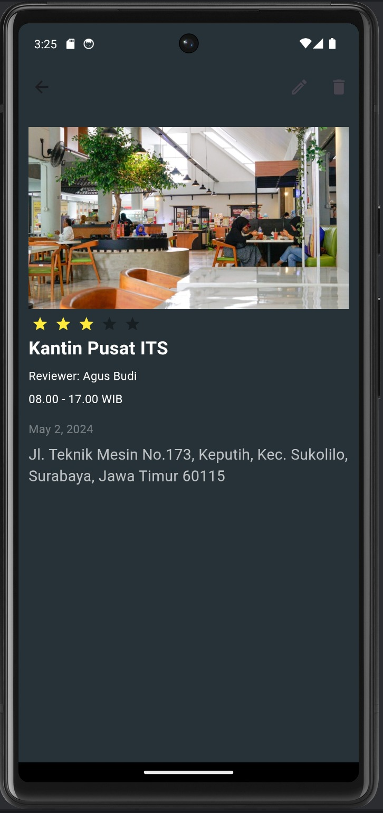

# Ujian Susulan_Midterm-Exam_Mobile-Device-Programming

## A. Student Identity
| Name           | NRP          | Class                            |
|----------------|--------------|----------------------------------|
| Rayssa Ravelia | 5025211219   | Pemrograman Perangkat Bergerak (H) |


## B. Repository Description
This repository hosts the source code for my mobile app developed for the midterm exam in the "Pemrograman Perangkat Bergerak" course. It features basic functionalities of a mobile application using Flutter and Dart, demonstrating key aspects of mobile development.

## C. Problem Description
Create this kind of app using flutter!


## D. Widget Implementation Examples (based on midterm exam points)

### Classes

## Images

### Error Handling

### Stateless and Stateful

### CRUD Sqflite

### Use atleast 5 different widgets

## E. How to run this repository
### E.1. Prerequisites
You need to have Flutter installed on your machine.
If you do not have Flutter installed, please follow the installation guide here:
https://flutter.dev/docs/get-started/install

### E.2. Run the program
1. Clone the repo
    ```bash
    git clone git@github.com:rayrednet/Midterm-Exam_Mobile-Device-Programming_Rayssa-Ravelia.git
    ```

2. Navigate to the project directory
    ```bash
    cd Midterm-Exam_Mobile-Device-Programming_Rayssa-Ravelia
    ```

3. Fetch all depencies
    ```bash
    flutter pub get
    ```

4. Run the app
    ```bash
    flutter run midterm_exam/lib/main.dart
    ```