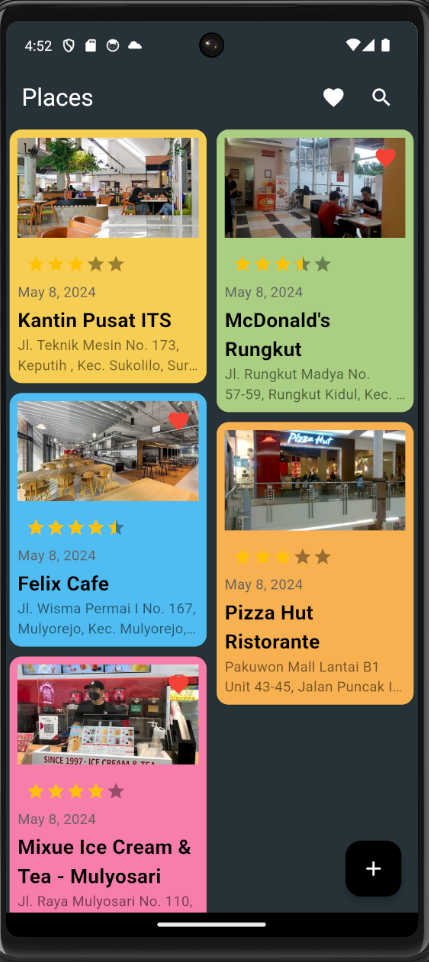
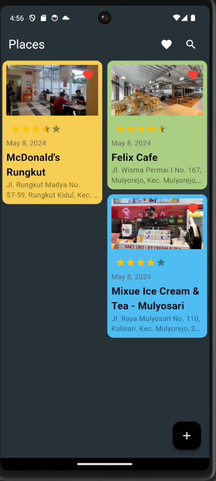
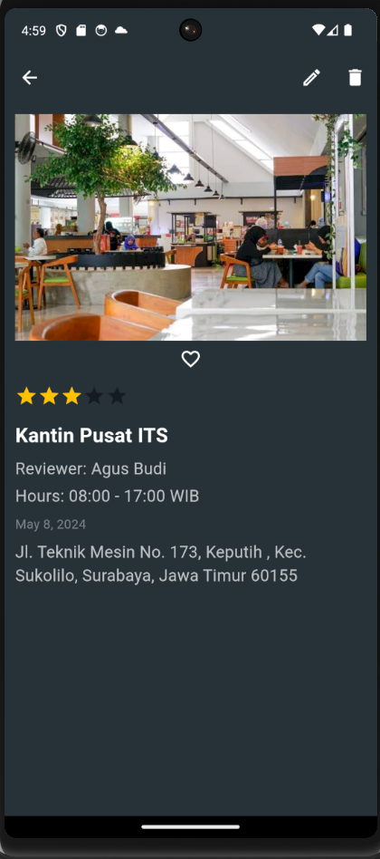
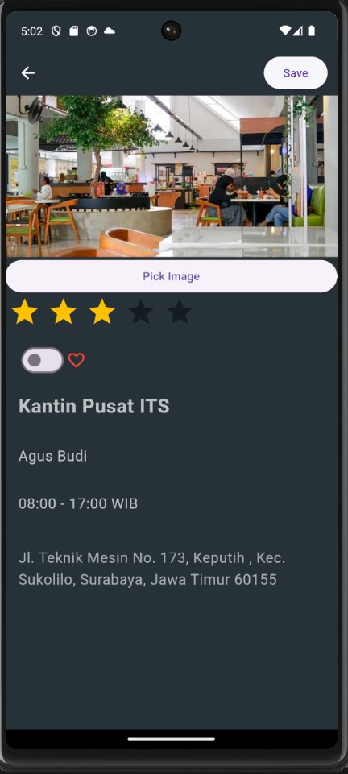
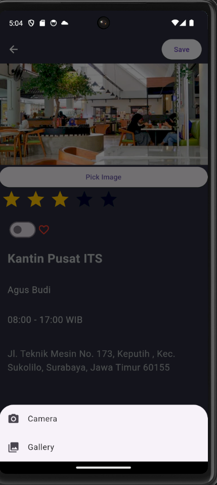

# Ujian Susulan_Midterm-Exam_Mobile-Device-Programming

## A. Student Identity
| Name           | NRP          | Class                            |
|----------------|--------------|----------------------------------|
| Rayssa Ravelia | 5025211219   | Pemrograman Perangkat Bergerak (H) |


## B. Repository Description
This repository hosts the source code for my mobile app developed for the midterm exam in the "Pemrograman Perangkat Bergerak" course. It features basic functionalities of a mobile application using Flutter and Dart, demonstrating key aspects of mobile development.

## C. Problem Description
Create this kind of app using flutter!
{height="50%" width="50%"}

## D. App Preview
### D.1. Home page
 \
The homepage serves as a central hub where users can interact with the application’s core features:
- **View All Places**: Users can browse through a comprehensive list of all places added to the app, complete with ratings, reviews, and images.
- **Add New Reviews**: By clicking the "+" button, users can easily contribute new reviews for places they have visited.
- **Search and Favorites**: The search functionality allows users to quickly find specific places, while the heart icon enables them to view their favorite locations.

### D.2. Favorite Places Feature
 

By tapping the heart icon at the top of the homepage, users can access their "Favorite Places" list. This feature compiles all the locations that users have marked as favorites, allowing for quick and easy access. It's perfect for revisiting cherished spots or planning future visits. The list is displayed with the same rich details as the main places list, including images, ratings, and brief descriptions to enhance user engagement and recall.

### D.3. Search Functionality


When users click the magnifying glass icon on the homepage, they are taken to the search interface. This page provides a clean, intuitive interface where users can type in the name or location of a place they are looking for. The results are displayed dynamically, allowing users to scroll through matching entries. Each entry provides brief details about the place, such as the name and address, and users can click on any entry to get more detailed information or to add it to their favorites. This feature ensures that users can quickly find specific places they are interested in visiting or reviewing.

### D.4. Place Details Page


When a user selects a place from the homepage, favorites, or search results, they are directed to the Place Details Page. This page provides a detailed view of the selected location, offering users the ability to deeply understand and interact with the place's information:

- **Image**: A high-quality image provides a visual representation of the place.
- **Star Rating**: Users can see the overall user rating based on reviews.
- **Reviewer's Name**: Displays the name of the user who last reviewed the place, adding a personal touch.
- **Operating Hours**: Lists the operating hours, helping users plan their visits effectively.
- **Address**: Provides the precise location, simplifying navigation to the place.

Additional functionalities on this page include:
- **Edit Button**: Allows users to update the place's details, ensuring the information is current and accurate.
- **Delete Button**: Users can remove the place from the app if it no longer exists or for other relevant reasons, helping maintain the app’s integrity and relevance.

These features empower users to not only gather information but also actively contribute to the quality and accuracy of the content within the app. Each interaction is designed to enhance the user's experience and engagement with the platform.

### D.5. Edit Page



The Edit Page provides users with the functionality to update or modify details of a place they have reviewed or added. Here’s what users can interact with on this page:

- **Image**: Users can update the main image of the place by clicking on "Pick Image" to select a new photo from their device.
- **Star Rating**: Allows users to adjust their rating through an interactive star rating system.
- **Favorite Toggle**: Users can tap the heart icon to mark or unmark the place as a favorite.
- **Place Details**: Fields such as the name, reviewer, operating hours, and address can be edited to ensure the information remains accurate and up-to-date.
- **Save Button**: After making the desired changes, users can save the updates by clicking the "Save" button at the top of the page.

This page empowers users to maintain current and helpful information about the places, fostering a dynamic and reliable community resource within the app.


### D.6. Image Selection Feature
 


Upon clicking "Pick Image" on the Edit Page, users are presented with two options to update the place's image:

- **Camera**: Selecting this option allows users to take a new photo using their device’s camera, providing an instant and convenient way to capture the current look of the place.
- **Gallery**: Users can choose an existing image from their device's gallery. This option is useful for uploading previously taken photos or more professionally edited images.

This feature enhances the user's ability to keep place images fresh and appealing, directly contributing to the quality and reliability of the app's content. After selecting the desired source, users can upload their new image and save changes by tapping the "Save" button.

## E. Widget Implementation Examples (based on midterm exam points)
Here are a few examples of widget implemetation used in this program based on the midterm exam points:
### E.1. Classes

```dart
class Note {
  final int? id;
  final bool isImportant;
  final int number;
  final String title;
  final String description;
  final DateTime createdTime;
  final String? imagePath;
  final double rating;
  final String reviewer;
  final String openingHours;
```
```dart
class NoteFields {
  static final List<String> values = [
    id, isImportant, number, title, description, time, imagePath, rating, reviewer, openingHours,
  ];
```

``` dart
class NoteFormWidget(
                isImportant: isImportant,
                number: number,
                title: title,
                description: description,
                reviewer: reviewer,
                openingHours: openingHours,
                onChangedImportant: (isImportant) =>
                    setState(() => this.isImportant = isImportant),
                onChangedNumber: (number) =>
                    setState(() => this.number = number),
                onChangedTitle: (title) => setState(() => this.title = title),
                onChangedDescription: (description) =>
                    setState(() => this.description = description),
                onChangedReviewer: (value) => setState(() => reviewer = value),
                onChangedOpeningHours: (value) => setState(() => openingHours = value),
              ),
```

### E.2. Images

```dart
  Future<void> pickMedia() async {
    final source = await showModalBottomSheet<ImageSource>(
        context: context,
        builder: (context) => Column(
              mainAxisSize: MainAxisSize.min,
              children: <Widget>[
                ListTile(
                  leading: const Icon(Icons.camera_alt),
                  title: const Text('Camera'),
                  onTap: () => Navigator.of(context).pop(ImageSource.camera),
                ),
                ListTile(
                  leading: const Icon(Icons.photo_library),
                  title: const Text('Gallery'),
                  onTap: () => Navigator.of(context).pop(ImageSource.gallery),
                ),
              ],
            ));
```

``` dart
ElevatedButton(
                onPressed: pickMedia,
                child: const Text('Pick Image'),
              ),
```


### E.3. Error Handling
```dart
if (isValid) {
      final isUpdating = widget.note != null;
      print("Updating existing note: $isUpdating");

      try {
        if (isUpdating) {
          await updateNote();
          print("Note updated successfully");
        } else {
          await addNote();
          print("Note added successfully");
        }
        Navigator.of(context).pop();
      } catch (e) {
        print("Failed to add or update note: $e");
        ScaffoldMessenger.of(context).showSnackBar(
            SnackBar(content: Text('Error: Failed to save note')));
      }
    } else {
      print("Form is not valid, not proceeding to save");
    }
```

### E.4. Stateless and Stateful
```dart
class MainApp extends StatelessWidget {
  static String title = 'Notes SQLite';

  const MainApp({super.key});

  @override
  Widget build(BuildContext context) {
    return MaterialApp(
      debugShowCheckedModeBanner: false,
      title: title,
      themeMode: ThemeMode.dark,
      theme: ThemeData(
        primaryColor: Colors.black,
        scaffoldBackgroundColor: Colors.blueGrey.shade900,
        appBarTheme: const AppBarTheme(
          backgroundColor: Colors.transparent,
          elevation: 0,
        ),
      ),
      home: const NotesPage(),
    );
  }
}
```
```dart
class NotesPage extends StatefulWidget {
  const NotesPage({super.key});

  @override
  State<NotesPage> createState() => _NotesPageState();
}
```

### E.5. CRUD Sqflite
This section outlines the CRUD (Create, Read, Update, Delete) operations using Sqflite in the Flutter app. Each operation is demonstrated with Dart code examples and their corresponding app behaviors.
#### E.5.1. Create
```dart

```

#### E.5.2. Read

#### E.5.3. Update

#### E.5.4. Delete

### E.6. Use atleast 5 different widgets

## F. How to run this repository
### F.1. Prerequisites
You need to have Flutter installed on your machine.
If you do not have Flutter installed, please follow the installation guide here:
https://flutter.dev/docs/get-started/install

### F.2. Run the program
1. Clone the repo
    ```bash
    git clone git@github.com:rayrednet/Midterm-Exam_Mobile-Device-Programming_Rayssa-Ravelia.git
    ```

2. Navigate to the project directory
    ```bash
    cd Midterm-Exam_Mobile-Device-Programming_Rayssa-Ravelia
    ```

3. Fetch all depencies
    ```bash
    flutter pub get
    ```

4. Run the app
    ```bash
    flutter run midterm_exam/lib/main.dart
    ```